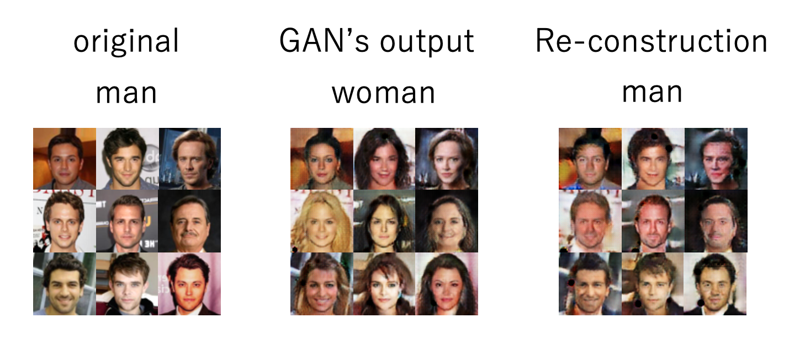
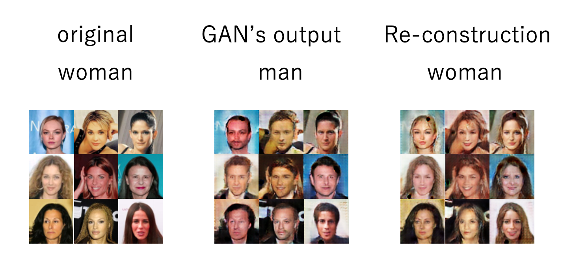

## dataset
### man's face
https://drive.google.com/drive/folders/1x4aHhoZBOFkBmUsfk3KZRcO9kvyk0b3d?usp=sharing

### woman's face
https://drive.google.com/drive/folders/1bTf2a70jX7YQkT8Q-6o8oKTqPFTlfIAJ?usp=sharing>

## How to train
If you want to train, please run "python train.py"
## result cycleGAN
### man to woman

### woman to man
